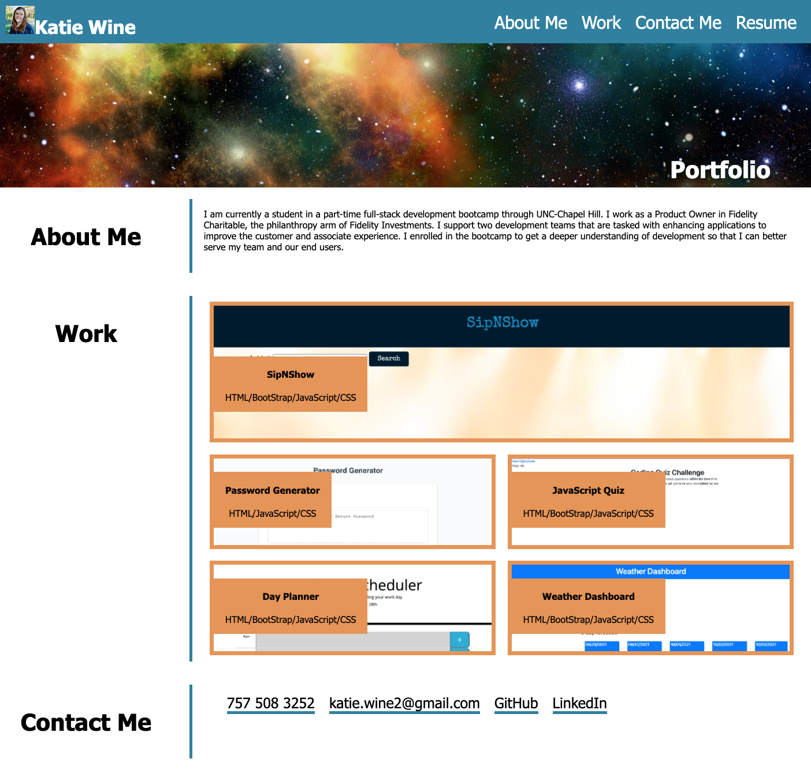

# Portfolio (Homework 2)

This project is a portfolio to showcase my future work created during the Coding Bootcamp. I have created a basic layout, that includes a header and body. The navigation at the top takes the viewer to the relatvant parts of the page. The links at the bottom navigate the viewer to call, email or visit the other links. As I finish more projects in bootcamp, I will replace the work images and link them to the live URL for the project. I added a placeholder link that goes to an existing project URL on GitHub. 

The most challenging part of this project was getting the layout and all of the flex boxes to cooperate. It was also the best learning experience of this project. I feel like I have a much better handle on flex boxes, their properties and how to use media queries. 

View my portfolio here:
[My Porfolio](https://kmwine02.github.io/homework02/)

and the repository here:
[GitHub Repository](https://github.com/kmwine02/homework02) 

